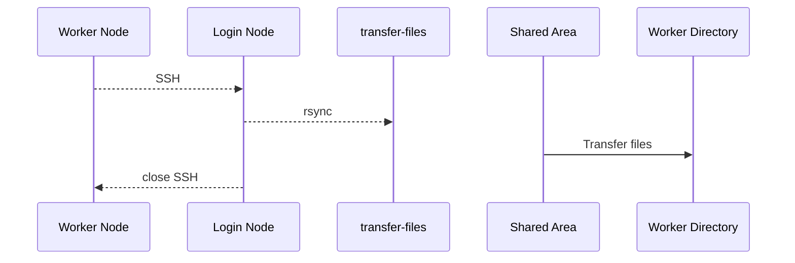

# HPC Workflow Recipes

## file-tranfers

The purpose of this script is to enable transfer of directories/files to/from shared areas whilst on a worker node, within an interactive session or batch job.

### Setup

Move file-transfers to ~/bin, make executable and add to .bashrc

```shell
mkdir -p ${HOME}/bin/
mv transfer-files ${HOME}/bin/transfer-files 
chmod +x ${HOME}/bin/transfer-files
echo 'export PATH="$PATH:$HOME/bin"' >> ~/.bashrc
source ~/.bashrc 
```
> NOTE: This script does not remove files once they are synced. 
  
Recommend assigning directories to variables. For example, create a **setup.sh** script:
```shell
#!/bin/bash
shared='/shared/path/to/directory/'
working_dir='/mnt/parscartch/users/${USER}/'
```
These variables are used in the examples below.

### Interactive usage

Usage:
```shell
transfer-files SOURCE DESTINATION
```

Example:
```shell
transfer-files ${shared}/some/path/ ${working_dir}/some/path/
```

### Batch jobs
Can also be submitted to the SLURM scheduler as a job submission (ex. useful for sbatch dependencies):

Default resource requests are 4G of memory and 10 minutes. 

Usage:
```shell
sbatch transfer-files SOURCE DESTINATION
```
Examples:
```shell
sbatch transfer-files ${shared}/some/path/ ${working_dir}/some/path/
```

```shell
sbatch --time=00:20:00 transfer-files ${shared}/some/path/ ${working_dir}/some/path/
```

> Caution: We need to be careful with trailing slashes

Trailing Slash in Source Directory: copies the contents of the source directory, but not the directory itself, into the destination.

If you want to copy the source directory itself into the destination, without merging its contents, you should omit the trailing slash: rsync source destination.

Trailing Slash in Destination Directory: copies the source into that directory, preserving its name.

If you don't want the source directory to be included in the destination, use a destination path without a trailing slash: rsync source/ destination


